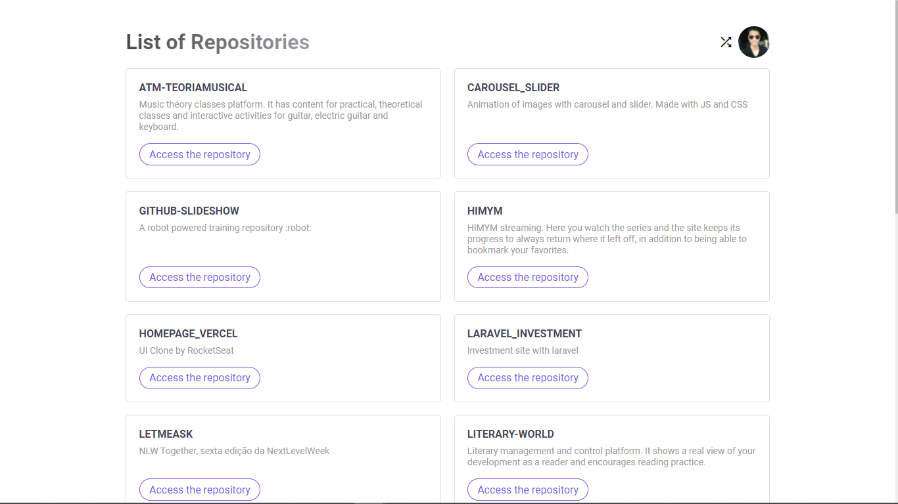
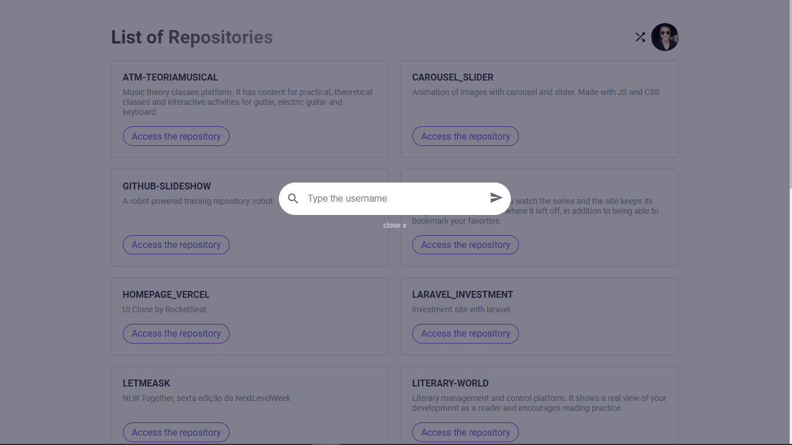

# Github Explorer



## Getting Started
  - Para rodar a aplicação execute os comandos:

  ```
    yarn install
    yarn dev
  ```

## Description
  - Essa aplicação foi configurada do total zero, configurando babel, webpack, e fazendo todas as configuração de importação e fast-refresh.
  - A aplicação consume dados da api do github para listar os repositórios de um determinado usuário.